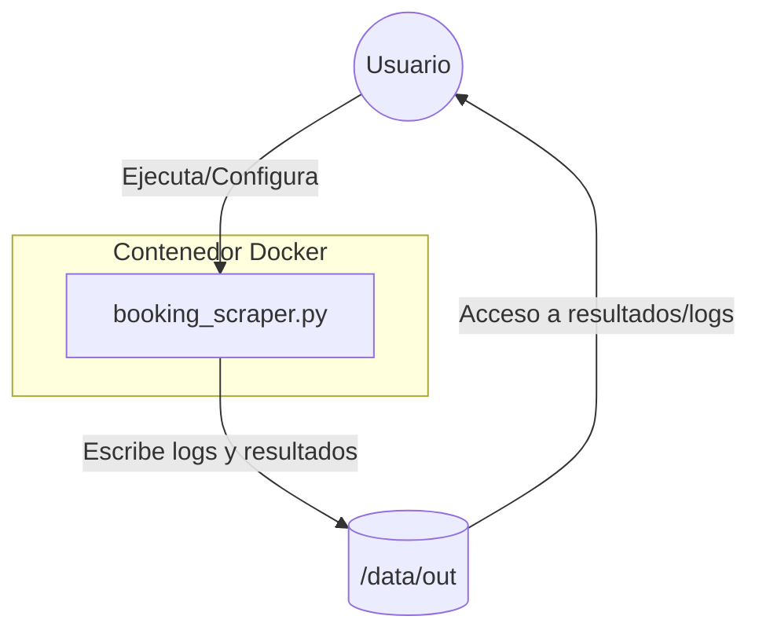

# Scraper Booking

Este proyecto es un scraper para Booking.com desarrollado en Python. Permite extraer información de alojamientos de la plataforma Booking de manera automatizada.

## Esquema de Directorios

```text
scraper_booking/
├── booking_scraper.py           # Script principal del scraper
├── requirements.txt             # Dependencias para ejecución local
├── README.md                    # Documentación del proyecto
├── __pycache__/                 # Archivos temporales de Python
└── webscp-stack/                # Entorno para despliegue en Docker/Swarm
    ├── booking_scraper.py       # Copia del script para el contenedor
    ├── prueba_scraper.py        # Script de prueba
    ├── requirements.txt         # Dependencias para el contenedor
    ├── Dockerfile               # Imagen Docker
    └── docker-compose.yml       # Orquestación y configuración de servicios
```

## Características principales
- Extracción de datos de alojamientos desde Booking.com, centrado en hoteles de Andalucía.
- Utiliza un cron que ejecuta el scraper diariamente, extrayendo información para los siguientes 30 días (a partir de la fecha actual de la página).
- Genera archivos `.njson` por cada fecha y provincia procesada.
- Crea un archivo de log por cada día de ejecución del cron.
- Uso de librerías Python para scraping (requests, BeautifulSoup, etc.)
- Soporte para ejecución local o mediante Docker

## Arquitectura del Proyecto

El despliegue de `booking_scraper.py` puede realizarse de dos formas principales: localmente o en un entorno contenerizado (Docker/Swarm). A continuación se describe la arquitectura general y el flujo de ejecución:

### Arquitectura General



- **Usuario**: Lanza el scraper y configura los parámetros necesarios.
- **booking_scraper.py**: Script principal que realiza el scraping y guarda los resultados y logs en `/data/out`.
- **/data/out**: Directorio compartido (montado como volumen en Docker/Swarm) donde se almacenan los resultados y logs.

### Resumen de Componentes
- `booking_scraper.py`: Lógica de scraping y logging.
- `Dockerfile`: Define la imagen del contenedor.
- `docker-compose.yml`: Orquestación y configuración de servicios y volúmenes.
- `/data/out`: Carpeta de salida para logs y datos.

### Despliegue en Docker/Swarm
- El contenedor se construye usando el `Dockerfile` y se orquesta con `docker-compose.yml` (o Swarm).
- El volumen `/elk-share/webscp/out` del host se monta como `/data/out` en el contenedor, permitiendo persistencia y acceso compartido a los resultados.
- Variables de entorno y políticas de despliegue se configuran en `docker-compose.yml`.

### Despliegue Local
- El script puede ejecutarse directamente en el sistema operativo, escribiendo los resultados en un directorio local (`/data/out` o el que se configure).

## Instalación

### Opción 1: Ejecución local
1. Clona este repositorio
2. Instala las dependencias:
   ```bash
   pip install -r requirements.txt
   ```
3. Ejecuta el scraper:
   ```bash
   python booking_scraper.py
   ```

### Opción 2: Usando Docker
1. Ve a la carpeta `webscp-stack`
2. Construye y levanta los contenedores:
   ```bash
   docker-compose up --build
   ```

## Uso
Ajusta los parámetros dentro de `booking_scraper.py` según tus necesidades (por ejemplo, ciudad, fechas, etc.).

## Notas
- Este scraper es solo para fines educativos.
- El uso de scrapers puede estar restringido por los términos de servicio de Booking.com.

## Autor
- Antonio García Carreño
